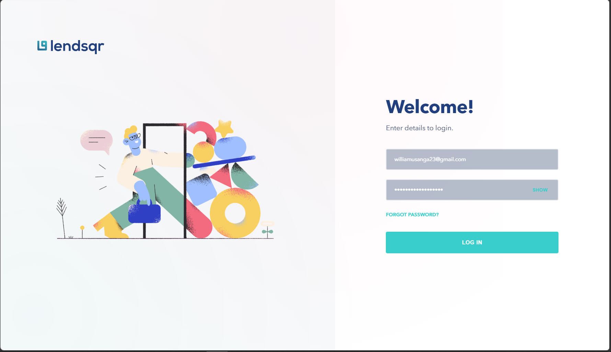
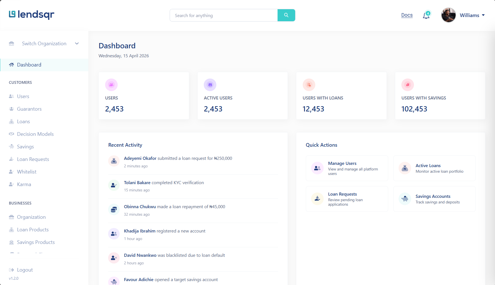
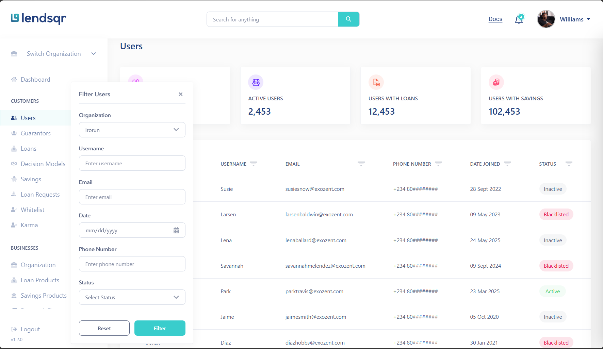
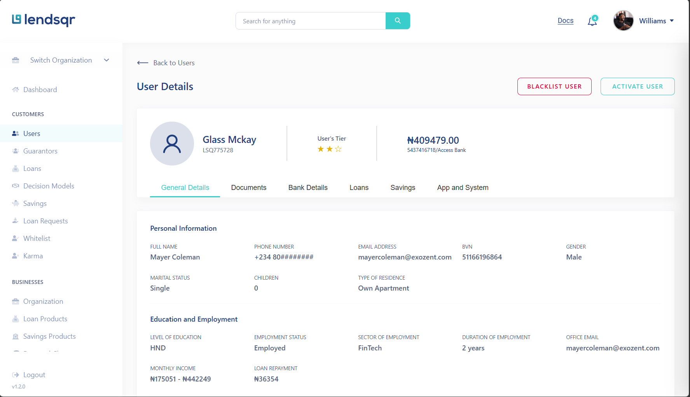

# Lendsqr Frontend Engineering Assessment Submission

## 1. Overview

This project is a frontend implementation of a loan operations dashboard for Lendsqr workflows. It covers authentication, operational dashboards, list and detail views for multiple domains (users, loans, transactions, reports, services, settlements, and more), and a reusable table system with filtering, sorting, and pagination.

The app is built with Next.js App Router and uses local mock API route handlers to simulate backend behavior while preserving realistic client-side architecture (service layer, API client, token lifecycle, and route protection).

### Core capabilities
- Authentication flow with guarded dashboard routes
- Modular dashboard pages and detail pages across many business entities
- Reusable GenericTable system with filters, sorting, row actions, and context-menu actions
- Service-layer data access with in-memory caching and request de-duplication
- Responsive layout with desktop sidebar and mobile-aware interactions
- Unit/component tests for utilities and key UI primitives

---

## 2. Live Demo and Repository

- Live demo: https://williams-samuel-lendsqr-fe-test.vercel.app/
- Repository: https://github.com/samuraicoderr/lendsqr-fe-test

---

## 3. Tech Stack

### Next.js (App Router)
- Why: File-system routing, colocated route handlers for mock APIs, and easy split between server route files and client components.
- How used: App routes for pages and dynamic details (`[id]`), plus mock endpoints under `src/app/mock-api/**`.

### TypeScript
- Why: Improves reliability for a broad dashboard domain with many entities and table schemas.
- How used: Strong typing for API contracts, table columns, filters, route params, auth payloads, and utility type guards.

### SCSS (modules + global tokens)
- Why: Better structure and maintainability for a large multi-screen UI with many reusable visual patterns.
- How used: Component-scoped module styles and shared tokens/mixins under `src/styles`.

### Zustand
- Why: Lightweight state management with predictable persistence behavior.
- How used: Auth/token state stores with persisted slices (`localStorage`) for token and partial auth context data.

### @popperjs/core
- Why: Correct dropdown positioning and overflow handling in dense table interfaces.
- How used: Filter dropdown positioning in `GenericTable` with placement, flip, and overflow prevention modifiers.

### react-tooltip
- Why: Low-cost enhancement for status explanation and table UX.
- How used: Status tooltip overlays for table status badges.

### Jest + Testing Library
- Why: Fast confidence on utility and UI behavior without standing up full E2E infra.
- How used: Unit/component tests for route helpers, auth redirect safety helpers, modal/status UI primitives, and error parsing utilities.

---

## 4. Application Architecture

### High-level structure
- `src/app`: Routes (App Router), layouts, pages, and mock API handlers
- `src/components`: Reusable UI/layout modules and domain screens
- `src/lib`: App config, route constants, API client, services, auth providers, types, and utilities
- `src/styles`: Global SCSS tokens/mixins/base utilities
- `tests` and `*.test.ts(x)`: Unit and component tests

### Component architecture
- Route page components are intentionally thin and delegate feature behavior to layout/domain components.
- Generic table behavior is centralized in `GenericTable` + `Paginator`, while domain tables provide column config, filter config, and row actions.
- Detail screens are separate modules per domain for straightforward ownership and isolated evolution.

### Separation of concerns
- UI concerns: `src/components/**`
- Domain API contracts: `src/lib/api/types/**`
- API transport and auth mechanics: `src/lib/api/ApiClient.ts` and `src/lib/api/auth/**`
- Data orchestration and cache policy: `src/lib/api/services/**`

### Routing strategy
- Next.js App Router with nested layouts:
  - Root layout wraps app in auth provider client
  - Dashboard layout wraps protected pages in `ProtectedRoute`
- Dynamic route segments (`[id]`) for detail views across all major entities

---

## 5. Data and State Management

### Mock API strategy
- Mock endpoints are implemented as Next.js route handlers (`src/app/mock-api/**`).
- User list endpoint supports filtering, sorting, and pagination via query params.
- Entity detail endpoints support GET and PATCH/PUT where needed, enabling realistic list/detail update flows.

### Data fetching flow
- Components call service methods (for example `UserService`, `LoanService`, `TransactionService`).
- Services call `apiClient` and return typed domain models.
- UI components manage rendering state (`loading`, `error`, `rows`) and delegate transport logic to services.

### Caching and de-duplication
- Services implement in-memory cache with TTL and in-flight request maps.
- Benefits:
  - Prevents duplicate concurrent requests for identical keys
  - Improves responsiveness on repeated list/detail navigation
  - Allows explicit invalidation after PATCH/PUT updates

### State management approach
- Zustand stores handle auth and tokens.
- Persisted slices are used for required continuity (`localStorage`), while most screen-level view state remains local to components.
- No IndexedDB is used in this implementation.

---

## 6. Key Features

### Authentication flow
- Login form validates credentials client-side before submission.
- Auth context executes login through API client and normalizes user payload shape.
- Redirects are sanitized (`next` param safety checks) to avoid unsafe redirect paths.
- Dashboard routes are protected with a wrapper component.
- Token lifecycle includes refresh handling and unauthorized callbacks.

### Dashboard
- Dashboard page provides summary cards and activity/quick-action modules.
- Navbar, Sidebar, content area, and notifications panel are composed in the dashboard layout.

### Users list (pagination/filtering)
- Users page combines a statistics header and reusable table implementation.
- Supports sortable columns, filter dropdown, pagination, and per-row actions.
- Domain-to-table adaptation is done via memoized column/filter/action configs.

### User details
- Dynamic detail route (`/dashboard/users/[id]`) loads user profile via `UserService.getUserById`.
- Status actions (blacklist/activate) call PATCH and update rendered state.
- Details are API-backed, with service-level in-memory cache rather than local detail snapshots in storage.

### Reusable table system
- `GenericTable` provides:
  - sorting
  - filter dialog and apply/reset
  - row actions menu and right-click support
  - loading and empty states
  - configurable pagination placement
- `Paginator` provides reusable page range logic with ellipsis and items-per-page control.

---

## 7. UI/UX and Responsiveness

### Responsiveness
- Dashboard layout supports mobile menu toggling and preserves desktop navigation ergonomics.
- Components are built with responsive SCSS modules and tokenized spacing/typography.

### Layout handling
- Shared top-level dashboard shell keeps navigation behavior consistent across pages.
- Thin route components reduce route-level complexity and improve maintainability.

### Dropdown and overflow handling
- Table filter dropdown uses Popper.js for robust placement near trigger controls.
- Dropdown rendering via portal avoids clipping by parent overflow contexts.
- Row action menus account for viewport boundaries and close on resize/scroll.

---

## 8. Testing

### What is tested
Current tests focus on deterministic building blocks:
- utility functions (`cn`, `interpretServerError`)
- route helper constants/builders (`FrontendLinks`, `BackendLinks`)
- auth redirect safety helpers
- UI primitives/components (`ConfirmModal`, `StatusPill`)

### Tools
- Jest configured with `next/jest`
- `jest-environment-jsdom`
- Testing Library + `@testing-library/jest-dom`

### Test types
- Unit tests for pure logic/helpers
- Component tests for interactive UI behavior and rendered output

---

## 9. Performance Considerations

- Service-layer TTL caching limits repetitive requests during list/detail navigation.
- In-flight request maps prevent duplicate concurrent requests for the same resource key.
- Memoization (`useMemo`, `useCallback`) is applied across table-heavy components to reduce unnecessary recalculation and rerenders.
- API client includes retry behavior for retryable errors and request timeout safeguards.
- Token refresh flow retries request paths after refresh where appropriate.

---

## 10. Trade-offs and Assumptions

- Mock API route handlers were used instead of a hosted backend to keep the assessment self-contained and reproducible.
- Some modules (for example forgot-password flow and parts of dashboard summary/activity) are intentionally demo-oriented to prioritize breadth of dashboard workflows.
- Local persistence is limited to auth continuity; entity data is transient in memory cache by design.
- This scope optimizes for architecture clarity and reusable UI patterns over production backend integration.

---

## 11. Challenges and Solutions

### 1) Realistic table interactions across many domains
- Challenge: Repeating complex table UX for many modules can cause duplication and drift.
- Solution: Built and iterated on `GenericTable` + `Paginator` abstractions, then fed them per-domain schema/config.

### 2) Reliable dropdown/menu positioning in dense UI
- Challenge: Manual positioning caused overflow and clipping issues.
- Solution: Moved filter dropdown positioning to Popper.js and portal rendering; added viewport-aware row menu constraints.

### 3) Token lifecycle reliability
- Challenge: Supporting mixed expiry formats and avoiding auth edge-case loops.
- Solution: Normalized expiry parsing, refresh token merge behavior, cookie sync for auth presence, and safe redirect handling.

### 4) Keeping data interactions realistic without external backend
- Challenge: Preserve realistic list/detail workflows while staying self-contained.
- Solution: Added mock route handlers with query-based filtering/sorting/pagination and PATCH/PUT updates.

---

## 12. Screenshots

### Login

### Dashboard

### Users List

### User Details

---

## 13. Conclusion

This assessment implementation is structured as a maintainable frontend system rather than a single-page demo. The project emphasizes reusable interaction patterns, typed data boundaries, practical auth/session handling, and mock-backed flows that mirror real product behavior. The result is a reviewer-friendly codebase with clear architecture, documented trade-offs, and room to extend into full production integration.
